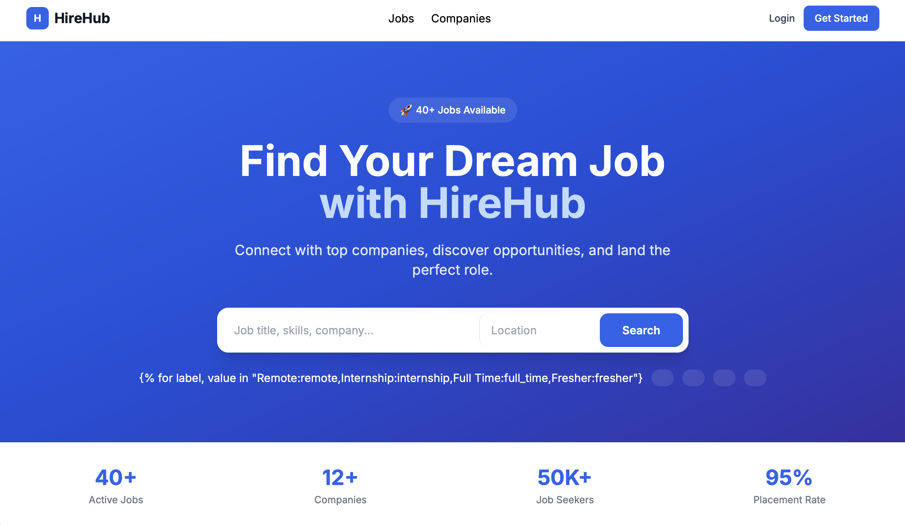
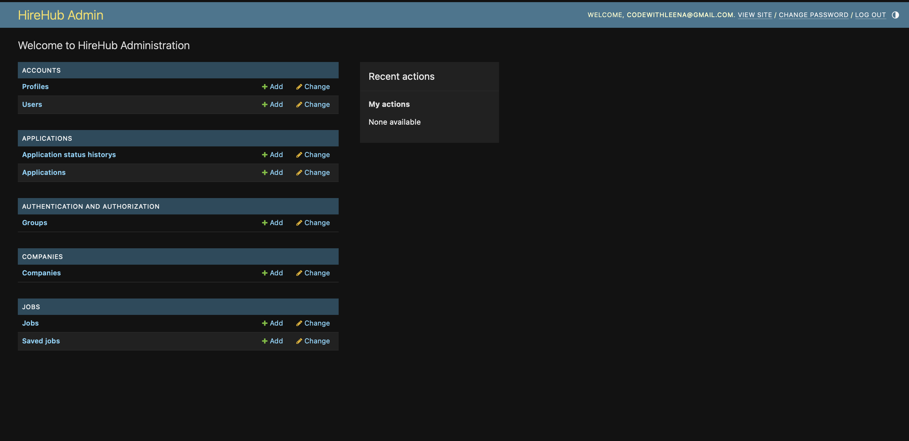
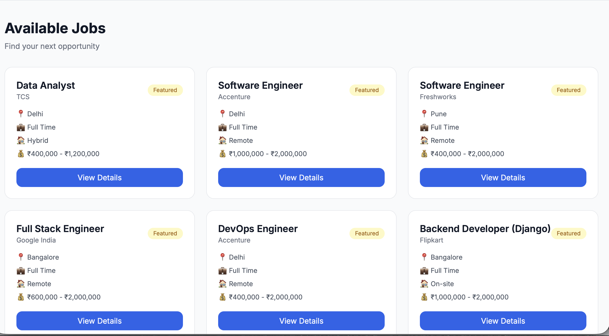
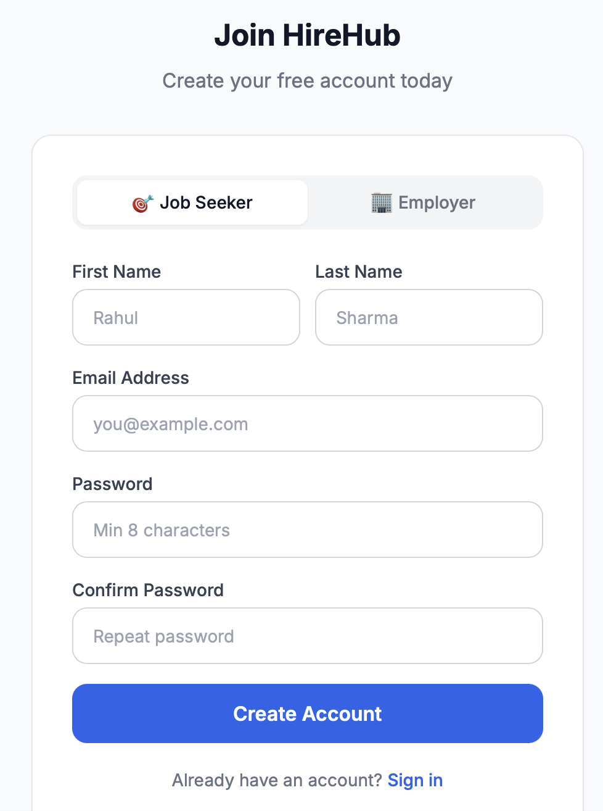
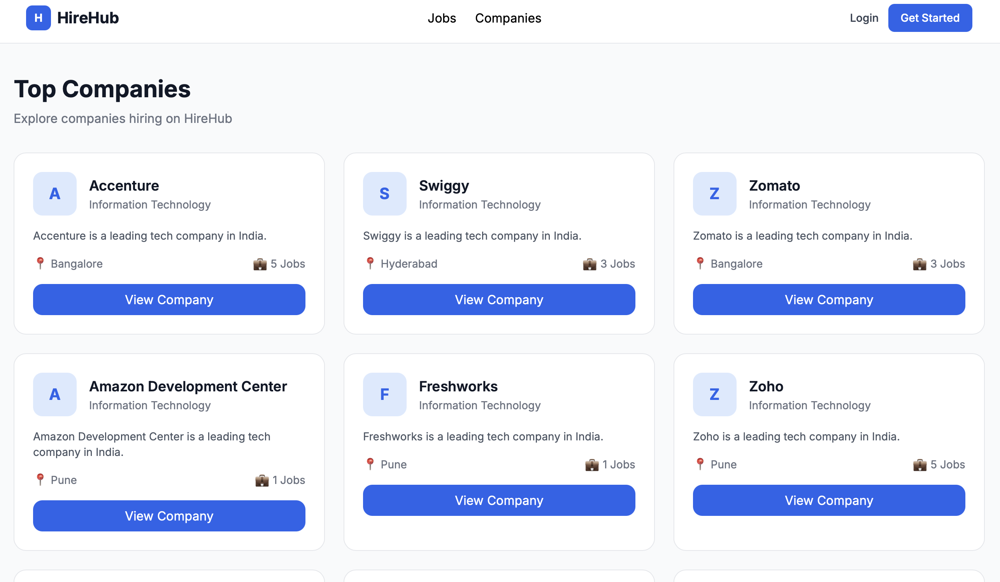

## 🎯 HireHub - Django Job Portal System

## 🌐 Live Demo
- Live Website: https://hirehub-job-portal-7.onrender.com
- GitHub Repository: https://github.com/CodeWithLeena/HireHub-Job-Portal

A full-featured job portal built with Django + Django REST Framework.
Companies post jobs, seekers apply, admin controls everything.

---

## 🚀 Features

### 👤 Job Seeker Side
- Signup / Login (JWT + Session auth)
- Profile: skills, experience, resume upload (PDF)
- Browse & search jobs (title, skills, location, filters)
- Apply for jobs with cover letter + resume
- Application status tracking (Pending → Shortlisted → Interview → Hired)
- Save / bookmark jobs

### 🏢 Company Side
- Employer registration + company profile
- Company must be approved by admin
- Post jobs with salary, type, skills, deadline
- View all applicants per job
- Accept / Reject / Schedule interview for candidates
- Email notifications on each status change

### 🔐 Admin Side
- Django Admin panel (full control)
- Approve / reject companies
- Feature jobs and companies
- Manage all users
- View application analytics

### ⚙️ Pro Features
- REST API (Django REST Framework)
- JWT Authentication
- Email notifications (job applied + status updates)
- Search + filters (salary, location, job type, work mode, experience)
- Resume upload (PDF) — both profile & per-application
- Pagination (10 per page)
- Application status history tracking
- Saved/bookmarked jobs

---

## 🛠️ Tech Stack

| Layer | Tech |
|-------|------|
| Backend | Django 4.2 |
| API | Django REST Framework 3.15 |
| Auth | JWT (djangorestframework-simplejwt) |
| Database | PostgreSQL (SQLite for dev) |
| Frontend | HTML + Tailwind CSS (CDN) |
| Email | SMTP (Gmail) |
| Media | Django FileField + Pillow |

---

## 📁 Project Structure

```
hirehub/
├── hirehub/              # Main project config
│   ├── settings.py       # All settings (DB, JWT, Email, etc.)
│   ├── urls.py           # Root URL config
│   └── wsgi.py
│
├── accounts/             # Custom User + Profile
│   ├── models.py         # User (custom), Profile
│   ├── serializers.py    # Register, Login, Profile serializers
│   ├── api_views.py      # REST API views
│   ├── api_urls.py       # /api/accounts/
│   ├── views.py          # Web views (login, register, dashboard)
│   ├── urls.py           # /accounts/
│   └── admin.py
│
├── companies/            # Company profiles
│   ├── models.py         # Company (status: pending/approved/rejected)
│   ├── api_views.py      # Company API
│   ├── api_urls.py       # /api/companies/
│   ├── views.py          # Web views
│   ├── urls.py
│   └── admin.py          # Approve/reject actions
│
├── jobs/                 # Job listings
│   ├── models.py         # Job, SavedJob
│   ├── serializers.py    # List, Detail, Create serializers
│   ├── api_views.py      # Search, filter, save API
│   ├── api_urls.py       # /api/jobs/
│   ├── views.py          # Web views
│   ├── urls.py
│   └── admin.py
│
├── applications/         # Job applications
│   ├── models.py         # Application, ApplicationStatusHistory
│   ├── serializers.py
│   ├── api_views.py      # Apply, status update + EMAIL logic
│   ├── api_urls.py       # /api/applications/
│   ├── views.py          # Web views
│   ├── urls.py
│   └── admin.py
│
├── templates/            # HTML templates (Tailwind CSS)
│   ├── base.html         # Navigation, footer, messages
│   ├── jobs/
│   │   ├── home.html     # Homepage with hero + search
│   │   ├── job_list.html # Browse jobs with filters
│   │   └── job_detail.html
│   ├── accounts/
│   │   ├── login.html
│   │   ├── register.html
│   │   ├── dashboard.html
│   │   └── profile.html
│   ├── companies/
│   │   └── ...
│   └── applications/
│       └── ...
│
├── media/                # Uploaded files (resumes, logos)
├── static/               # CSS, JS, images
├── requirements.txt
└── manage.py
```

---

## 📦 Installation

### 1. Clone & setup virtual environment
```bash
git clone <your-repo>
cd hirehub
python -m venv venv
source venv/bin/activate  # Windows: venv\Scripts\activate
```

### 2. Install dependencies
```bash
pip install -r requirements.txt
```

### 3. Configure environment
Create `.env` file:
```env
SECRET_KEY=your-secret-key-here
DEBUG=True
DB_NAME=hirehub_db
DB_USER=postgres
DB_PASSWORD=yourpassword
DB_HOST=localhost
DB_PORT=5432
EMAIL_USER=your@gmail.com
EMAIL_PASS=your-app-password
```

### 4. PostgreSQL setup
```bash
psql -U postgres
CREATE DATABASE hirehub_db;
\q
```

> For SQLite (quick dev): Comment out PostgreSQL in settings.py, uncomment SQLite block.

### 5. Run migrations
```bash
python manage.py makemigrations
python manage.py migrate
```

### 6. Create superuser
```bash
python manage.py createsuperuser
# Enter email, name, password
```

### 7. Run server
```bash
python manage.py runserver
```

Visit: http://127.0.0.1:8000

---

## 🔗 API Endpoints

### Auth
| Method | URL | Description |
|--------|-----|-------------|
| POST | `/api/accounts/register/` | Register user |
| POST | `/api/accounts/login/` | Login → JWT tokens |
| POST | `/api/accounts/token/refresh/` | Refresh JWT |
| POST | `/api/accounts/logout/` | Logout (blacklist) |
| GET | `/api/accounts/me/` | Current user info |
| GET/PUT | `/api/accounts/profile/` | Update profile |

### Jobs
| Method | URL | Description |
|--------|-----|-------------|
| GET | `/api/jobs/` | List jobs (search + filter) |
| GET | `/api/jobs/?q=python&work_mode=remote` | Search |
| GET | `/api/jobs/featured/` | Featured jobs (homepage) |
| POST | `/api/jobs/create/` | Create job (employer) |
| GET | `/api/jobs/<slug>/` | Job detail |
| GET/PUT | `/api/jobs/<id>/manage/` | Update/delete job |
| GET | `/api/jobs/mine/` | Company's own jobs |
| GET/POST | `/api/jobs/saved/` | Saved jobs |

### Companies
| Method | URL | Description |
|--------|-----|-------------|
| GET | `/api/companies/` | List approved companies |
| POST | `/api/companies/register/` | Register company |
| GET | `/api/companies/<slug>/` | Company detail |
| GET/PUT | `/api/companies/mine/` | My company |

### Applications
| Method | URL | Description |
|--------|-----|-------------|
| POST | `/api/applications/apply/` | Apply for job |
| GET | `/api/applications/mine/` | My applications |
| GET | `/api/applications/company/<job_id>/` | Job applicants |
| PATCH | `/api/applications/<id>/status/` | Update status |
| POST | `/api/applications/<id>/withdraw/` | Withdraw |

---

## 📊 Database Models

```
User (custom)          Profile               Company
├── email (unique)     ├── user (1:1)        ├── owner (FK User)
├── first_name         ├── headline          ├── name
├── last_name          ├── bio               ├── description
├── role               ├── skills            ├── industry
│   jobseeker/         ├── experience_level  ├── size
│   employer/          ├── resume (PDF)      ├── logo
│   admin              ├── linkedin          ├── status
├── is_verified        ├── github            │   pending/approved/
└── avatar             ├── city              │   rejected/suspended
                       └── is_available      └── approved_by

Job                    Application            ApplicationStatusHistory
├── company (FK)       ├── applicant (FK)     ├── application (FK)
├── posted_by (FK)     ├── job (FK)           ├── previous_status
├── title              ├── cover_letter       ├── new_status
├── description        ├── resume (PDF)       ├── changed_by
├── skills_required    ├── expected_salary    ├── note
├── job_type           ├── notice_period      └── changed_at
├── work_mode          ├── status
├── salary_min/max     │   pending/shortlisted
├── location           │   interview/offer/
├── status             │   hired/rejected/
└── views_count        │   withdrawn
                       └── interview_date
```

---

## 🔥 Pro Tips for Interview

1. **JWT Authentication** — Explain the access + refresh token flow
2. **Custom User Model** — `AbstractBaseUser` with `UserManager`
3. **Role-based access** — `user.is_employer`, `user.is_jobseeker` properties
4. **Email notifications** — `send_mail()` on apply + status change
5. **Pagination** — `PageNumberPagination` with `PAGE_SIZE=10`
6. **Search** — `SearchFilter` with `search_fields`
7. **Admin actions** — Bulk approve/reject companies
8. **Signal alternative** — Manual profile creation in serializer `create()`

---

## 📧 Email Setup (Gmail)

1. Enable 2-Factor Authentication on Gmail
2. Generate App Password: Google Account → Security → App Passwords
3. Set `EMAIL_HOST_PASSWORD` to the 16-char app password

---

## 📸 Screenshots

### Homepage


### Dashboard


### Jobs Page


### CreateAccount


### Company Page



---


Built with ❤️ using Django + DRF | HireHub v1.0
=======
# HireHub-Job-Portal
Full-stack Django job portal with JWT auth, PostgreSQL, REST APIs, company dashboards, and application tracking.

